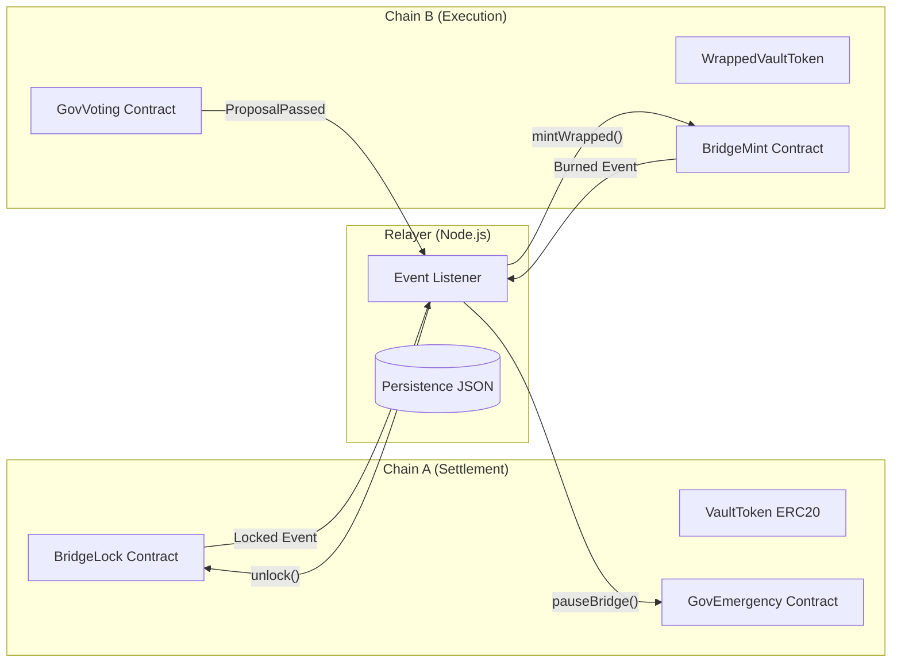

# Two-Chain Asset Bridge with Cross-Chain Governance

This project implements a secure, two-chain asset bridge with a Node.js relayer and emergency governance. It features:
- **Lock-and-Mint / Burn-and-Unlock**: Seamless asset movement between Chain A (Settlement) and Chain B (Execution).
- **Relayer Reliability**: 3-block confirmation delay, idempotent operations, and persistent state to prevent replay attacks and survive crashes.
- **Cross-Chain Governance**: A voting system on Chain B that can trigger emergency actions (pausing the bridge) on Chain A.
- **Containerized Ecosystem**: Fully orchestrated with Docker Compose for easy deployment.

## Architecture



## Setup & Running

1. **Environment**: Create a `.env` file from `.env.example`.
   ```bash
   cp .env.example .env
   ```

2. **Start Chains & Relayer**:
   ```bash
   docker-compose up --build
   ```

3. **Deploy (Manual on host for testing)**:
   ```bash
   npx hardhat run scripts/deploy-chain-a.js --network chainA
   npx hardhat run scripts/deploy-chain-b.js --network chainB
   ```

4. **Integration Testing**:
   ```bash
   npx hardhat test tests/Integration.test.js
   ```

## Security Patterns
1. **Replay Protection**: Every bridge operation uses a unique nonce. The relayer persists these nonces, and the smart contracts verify them on-chain.
2. **Pausability**: The bridge can be paused by governance to prevent exploits.
3. **Role-Based Access**: Specialized roles (Relayer, Emergency, Minter) ensure that only authorized accounts/contracts can perform sensitive actions.

## Tests
- `tests/BridgeUnit.test.js`: Comprehensive unit tests for all contracts.
- `tests/Integration.test.js`: End-to-end simulation of the bridging and governance flow.
